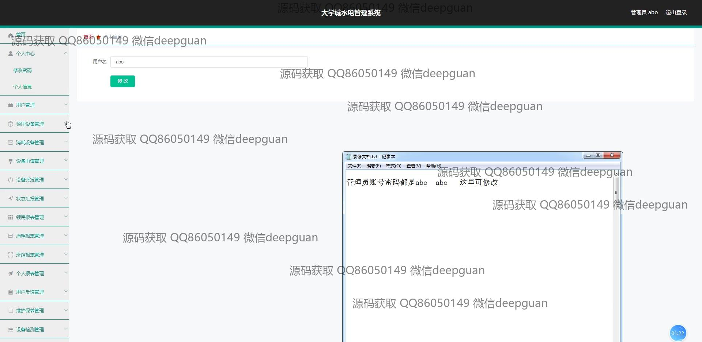
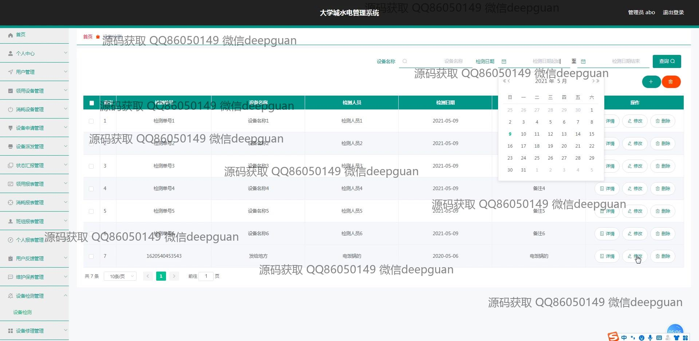

<h1 align="center">大学城水电管理系统</h1>

## 简介
大学城水电管理系统：角色分为管理员和用户；实现用户管理、设备管理、账单生成、水电费查询与缴纳、设备申请与维护、使用反馈等功能，提高校园水电管理效率和资源利用率。    --计算机毕业设计源码；毕设源码；java毕业设计源码

## 联系方式

<h3 align="center">获取完整代码与数据库文件 + 微信：deepguan QQ: 86050149 QQ群: 783742310</h3>

<h3 align="center">可帮忙远程部署 包运行成功！提供远程部署、修改代码、设计文档指导、代码讲解等服务！</h3>

## 功能介绍（完整见运行截图）
管理员： 管理员可以通过系统进行登录、注册和退出操作。系统首页提供了管理的主导航和快速访问功能，方便管理员查看和管理水电账单、设备申请、用户账户及设备状态。此外，管理员可以生成账单，维护系统数据，并处理用户反馈，确保系统的高效运作和准确数据记录。

用户： 用户通过注册登录系统后，可进行个人信息的查看与修改，管理自己的水电设备申请与领用记录。用户界面简单明了，支持设备查询、状态记录管理和使用反馈，以便用户有效管理水电使用情况。同时，用户还能查看和缴纳水电费用，获取历史账单信息，享受高效便捷的支付体验。

## 运行截图

本代码来源于网络,仅供学习参考使用!

